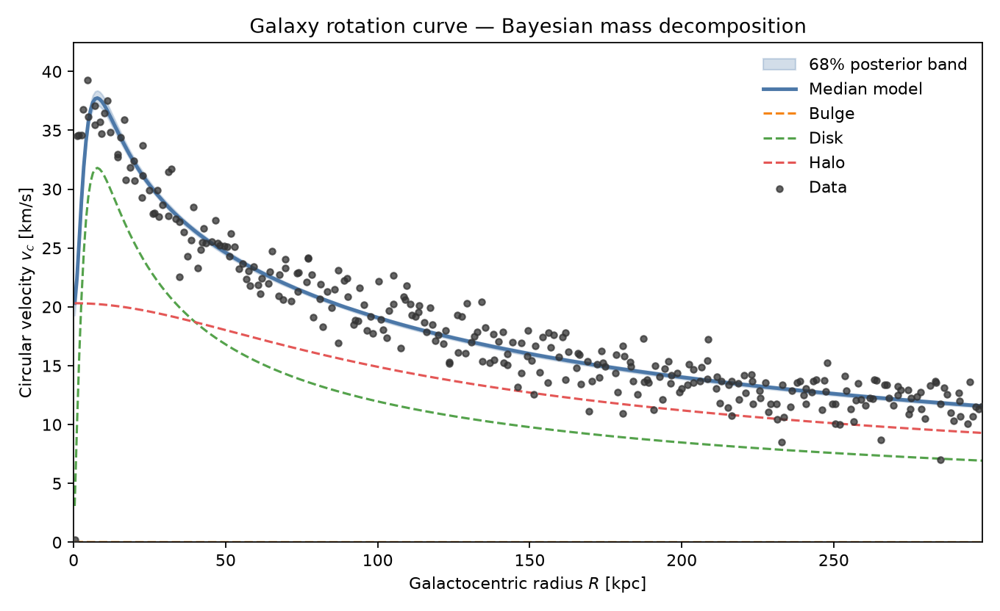
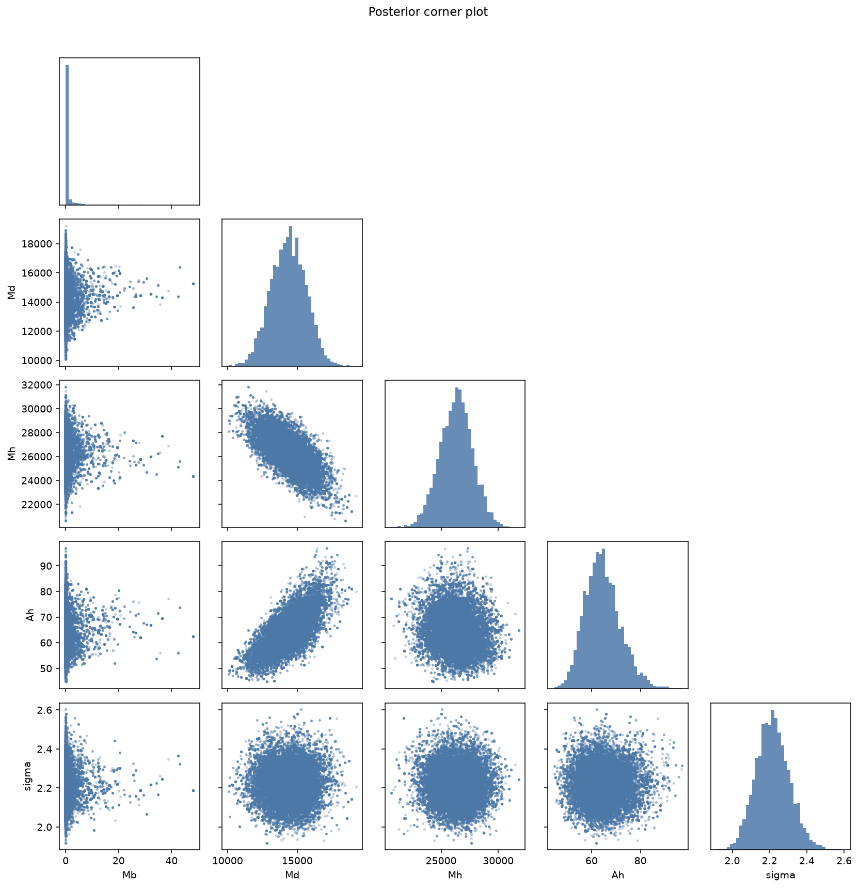
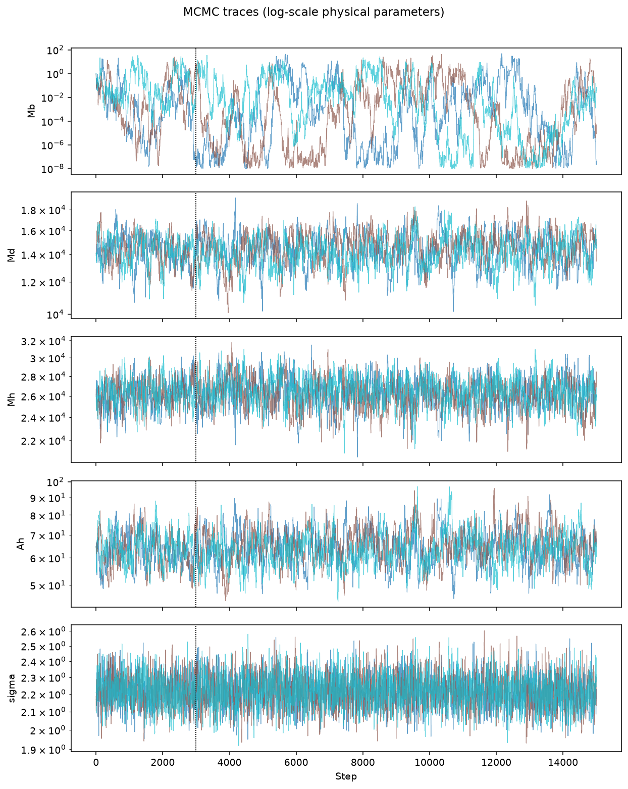

# Galaxy MCMC — Bayesian Mass Decomposition from Rotation Curves

**Infer the bulge, stellar disk, and dark-matter halo masses of a galaxy from its observed rotation curve using Metropolis–Hastings Monte Carlo.**

Galaxy rotation curves do not fall as Keplerian point masses would predict: they stay high at large radii. That kinematic signature is one of the classic empirical pillars of dark matter. This project turns that idea into a concrete Bayesian inference pipeline: given measured circular velocities \(v_c(R)\), it samples the posterior of a three-component galactic mass model and returns uncertainties, diagnostics, and publication-ready figures.

<p align="center">
  
</p>

<p align="center">
  
  &nbsp;
  
</p>

---

## Why this project

| Problem | What this repo delivers |
| --- | --- |
| Rotation curves encode mass, but components are degenerate | Full posterior over bulge / disk / halo masses, not a single point estimate |
| Classical \(\chi^2\) fits hide uncertainty | Metropolis–Hastings MCMC with burn-in, adaptation, and Gelman–Rubin \(\hat{R}\) |
| Homework-grade C prototypes are hard to trust | Corrected physics + modern Python package + regression tests |
| Results need to be communicable | Trace plots, corner plots, and a posterior predictive band on \(v_c(R)\) |

This repository started as a computational-methods homework (legacy C + matplotlib). It has been rebuilt into a small research-style toolkit you can install, test, and extend.

---

## Physical model

Circular velocity is the quadrature sum of three analytic contributions (Plummer bulge, Miyamoto–Nagai disk, Allen–Santillán-like halo):

\[
v_c(R)=\sqrt{v_b^2(R)+v_d^2(R)+v_h^2(R)}
\]

\[
\begin{aligned}
v_b^2 &= M_b\, R^2\big/\big(R^2+B_b^2\big)^{3/2},\\
v_d^2 &= M_d\, R^2\big/\big(R^2+(B_d+A_d)^2\big)^{3/2},\\
v_h^2 &= M_h\big/\big(R^2+A_h^2\big)^{1/2}.
\end{aligned}
\]

Geometric scales are fixed (kpc):

| Symbol | Value | Component |
| --- | ---: | --- |
| \(B_b\) | 0.2497 | Bulge |
| \(B_d\) | 5.16 | Disk scale length |
| \(A_d\) | 0.3105 | Disk scale height |
| \(A_h\) | 64.3 | Halo |

Free parameters \(M_b, M_d, M_h\) are **scaled masses** with \(G\) absorbed (units of \((\mathrm{km\,s^{-1}})^2\,\mathrm{kpc}\)). Optionally the halo scale \(A_h\) and/or the Gaussian noise \(\sigma\) can be inferred as well (`--fit-ah`, `--fit-sigma`).

Likelihood (independent Gaussian errors):

\[
\log\mathcal{L}(\theta)=-\tfrac12\sum_i\left(\frac{V_i-v_c(R_i;\theta)}{\sigma}\right)^2 - N\log\sigma + \mathrm{const}.
\]

Priors are uniform on \(\log M\) over a wide box (and on \(\log\sigma\) when fitted).

---

## Quick start

```bash
# Install
python3 -m pip install -r requirements.txt
python3 -m pip install -e .

# Smoke test (~seconds)
make quick
# or: python3 scripts/run_inference.py --quick

# Full inference (recommended)
make run
# or: python3 scripts/run_inference.py --fit-ah --fit-sigma

# Mock-data recovery check
make mock

# Unit tests
make test
```

Outputs land in `results/`:

- `rotation_curve_fit.png` — data, median model, 68% band, component curves
- `residuals.png` — data − model versus radius
- `mcmc_traces.png` — chain traces
- `posterior_corner.png` — pairwise posteriors
- `posterior_summary.txt` / `.json` — medians, credible intervals, \(\hat{R}\)
- `posterior_samples.npy` — combined posterior draws

---

## Example results (included dataset)

On `data/RadialVelocities.dat` (300 points, \(R\sim0.3\)–\(300\,\mathrm{kpc}\)):

- **Disk and halo masses are well constrained**; the bulge mass is consistent with near-zero — the dataset does not require a significant central bulge.
- Typical RMSE of the median model is \(\sim 2\,\mathrm{km\,s^{-1}}\).
- Multiple independent chains yield Gelman–Rubin \(\hat{R}\approx 1\) for \(\log M_d\) and \(\log M_h\).

That decomposition is the scientific punchline: baryons (disk) set the inner curve; the extended halo sustains the outer velocities.

---

## Repository layout

```
data/                  Observed rotation curve
src/galaxy_mcmc/       Installable Python package
  model.py             Bulge + disk + halo potential
  likelihood.py        Priors and Gaussian likelihood
  mcmc.py              Adaptive Metropolis–Hastings + R-hat
  plotting.py          Diagnostics and fit figures
  io.py                Data loader
scripts/run_inference.py   CLI entry point
tests/                 Pytest suite
docs/                  Theory and usage notes
legacy/                Corrected original C homework pipeline
results/               Generated figures and summaries
```

---

## Algorithms & improvements over the original code

The original C Metropolis–Hastings sketch had several critical issues (integer division in exponents, likelihood evaluated on a single point, broken accept/reject branches, parameters forced into \([0,1]\), `pow(R,R)` instead of \(R^2\)). This rewrite fixes them and goes further:

1. **Correct circular-velocity formula** — components summed in quadrature.
2. **Full \(\chi^2\) likelihood** over all radii.
3. **Log-parameter sampling** — enforces positivity and improves mixing.
4. **Adaptive proposal scales** targeting ~25% acceptance.
5. **Multi-chain diagnostics** (Gelman–Rubin \(\hat{R}\)).
6. **Optional free \(\sigma\)** for realistic noise inference.
7. **Automated figures and JSON summaries**.
8. **Regression tests** that lock the physics and a short MCMC recovery.

The cleaned C version in `legacy/` remains as a transparent, dependency-light reference:

```bash
cd legacy && make -f Tarea5.mk
```

---

## Using the library in Python

```python
from galaxy_mcmc import GalaxyPotential, load_rotation_curve
from galaxy_mcmc.likelihood import RotationCurvePosterior
from galaxy_mcmc.mcmc import run_ensemble

R, V = load_rotation_curve()
posterior = RotationCurvePosterior(R, V, GalaxyPotential(), fit_sigma=True)
chains = run_ensemble(posterior, n_chains=4, n_steps=25_000, burn_in=5_000)

samples = chains[0].samples  # shape (n_kept, n_params)
print(chains[0].summary())
```

---

## Documentation

- [Theory & model derivation](docs/theory.md)
- [Usage & interpretation guide](docs/usage.md)
- [Legacy C notes](docs/legacy.md)

---

## Citation / provenance

Originally developed as a computational-methods assignment on Monte Carlo methods and Bayesian parameter estimation for galactic rotation curves. Rebuilt as a reusable inference package with corrected models, diagnostics, and documentation.

If you use this code in coursework or a portfolio, please keep attribution to the original author and link back to this repository.

---

## License

MIT — see [`LICENSE`](LICENSE).
