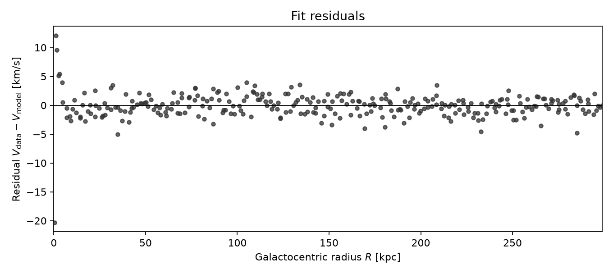
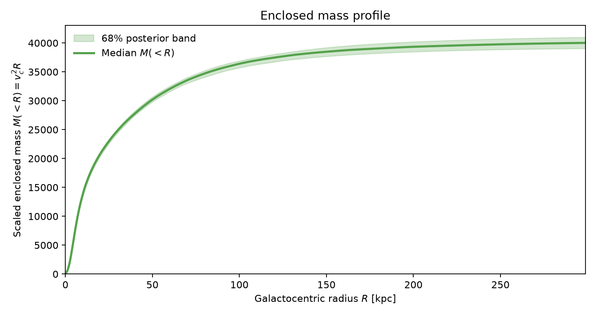

# Galaxy MCMC

### Bayesian mass decomposition from galaxy rotation curves

**Turn a rotation curve into posterior constraints on bulge, disk, and dark-matter halo mass — with uncertainties, diagnostics, and publication-ready figures.**

Flat outer rotation curves are one of the classic empirical signatures of dark matter. This repository takes that idea seriously: given measured circular velocities \(v_c(R)\), it runs Metropolis–Hastings Monte Carlo on a three-component galactic mass model and returns a full posterior, not a single best-fit point.

<p align="center">
  
</p>

<p align="center">
  
  &nbsp;
  
</p>

---

## Why it matters

| Challenge | What this repo gives you |
| --- | --- |
| Mass components are degenerate | Joint posterior over \(M_b\), \(M_d\), \(M_h\) (and optionally \(A_h\), \(\sigma\)) |
| A \(\chi^2\) minimum hides uncertainty | Credible intervals, predictive bands, and Gelman–Rubin \(\hat{R}\) |
| Homework MCMC code is often wrong | Corrected physics, adaptive MH, mock recovery, CI tests |
| Results need to communicate | Fit, residuals, enclosed mass, traces, and corner plots |

Originally a computational-methods homework. Rebuilt into a small, installable inference toolkit you can run, test, and show in a portfolio.

---

## Features

- **Physics-correct** bulge + disk + halo rotation curve (\(v_c^2 = v_b^2 + v_d^2 + v_h^2\))
- **Adaptive Metropolis–Hastings** in log-parameter space
- **Optional free halo scale** \(A_h\) and noise \(\sigma\)
- **Multi-chain diagnostics** (acceptance rate + Gelman–Rubin \(\hat{R}\))
- **Figures out of the box**: fit, residuals, enclosed mass \(M(<R)\), traces, corner
- **Reproducible outputs**: JSON summary with seed + copy-paste command; samples as `.npy` and `.csv`
- **Mock recovery check** proving the sampler recovers known masses
- **Legacy C pipeline** kept for teaching / comparison
- **GitHub Actions CI** running the test suite on every push

---

## Physical model

\[
v_c(R)=\sqrt{v_b^2(R)+v_d^2(R)+v_h^2(R)}
\]

\[
\begin{aligned}
v_b^2 &= M_b\, R^2\big/\big(R^2+B_b^2\big)^{3/2},\\
v_d^2 &= M_d\, R^2\big/\big(R^2+(B_d+A_d)^2\big)^{3/2},\\
v_h^2 &= M_h\big/\big(R^2+A_h^2\big)^{1/2}.
\end{aligned}
\]

| Symbol | Default [kpc] | Role |
| --- | ---: | --- |
| \(B_b\) | 0.2497 | Bulge scale (fixed) |
| \(B_d\) | 5.16 | Disk scale length (fixed) |
| \(A_d\) | 0.3105 | Disk scale height (fixed) |
| \(A_h\) | 64.3 | Halo scale (**optional free** via `--fit-ah`) |

\(M_b, M_d, M_h\) are scaled masses with \(G\) absorbed (units \((\mathrm{km\,s^{-1}})^2\,\mathrm{kpc}\)).

**Likelihood:** independent Gaussian errors with scale \(\sigma\) (fixed or free).  
**Priors:** uniform on \(\log M\) (and on \(\log A_h\), \(\log\sigma\) when fitted).

Details: [docs/theory.md](docs/theory.md).

---

## Quick start

```bash
python3 -m pip install -r requirements.txt
python3 -m pip install -e .

make test    # unit + mock-recovery tests
make mock    # synthetic truth recovery (standalone)
make quick   # short smoke run
make run     # full inference: --fit-ah --fit-sigma
```

Outputs go to `results/`:

| File | Contents |
| --- | --- |
| `rotation_curve_fit.png` | Data, median model, 68% band, component curves |
| `residuals.png` | Data − model vs radius |
| `enclosed_mass.png` | Scaled \(M(<R)=v_c^2 R\) with posterior band |
| `mcmc_traces.png` | Chain traces |
| `posterior_corner.png` | Pairwise posteriors |
| `posterior_summary.txt` / `.json` | Medians, intervals, \(\hat{R}\), seed, reproducibility command |
| `posterior_samples.npy` / `.csv` | Combined posterior draws |

Full CLI and API notes: [docs/usage.md](docs/usage.md).

---

## Example results

Dataset: `data/RadialVelocities.dat` (300 points, \(R \sim 0.3\)–\(300\,\mathrm{kpc}\)).

Run: `--fit-ah --fit-sigma` (4 chains × 20k steps).

| Parameter | Median | 16%–84% |
| --- | ---: | ---: |
| \(M_b\) | \(\sim 0\) | weakly constrained |
| \(M_d\) | \(1.44\times 10^4\) | \(1.31\)–\(1.57\times 10^4\) |
| \(M_h\) | \(2.63\times 10^4\) | \(2.49\)–\(2.77\times 10^4\) |
| \(A_h\) [kpc] | \(64.0\) | \(57.4\)–\(71.9\) |
| \(\sigma\) [km/s] | \(2.22\) | \(2.13\)–\(2.31\) |

**Takeaway:** the disk shapes the inner curve; the halo sustains the outer velocities; this dataset does not require a significant bulge. \(\hat{R}\approx 1\) for well-constrained parameters.

<p align="center">
  
</p>

---

## Project layout

```
data/                      Observed rotation curve
src/galaxy_mcmc/           Installable Python package
  model.py                 Bulge + disk + halo potential
  likelihood.py            Priors + Gaussian likelihood
  mcmc.py                  Adaptive MH + Gelman–Rubin
  plotting.py              Fit / residual / mass / diagnostics figures
  io.py                    Data loader
scripts/run_inference.py   Main CLI
scripts/mock_recovery.py   Synthetic recovery check
tests/                     Pytest suite
docs/                      Theory, usage, legacy notes + figures
legacy/                    Corrected original C homework pipeline
.github/workflows/         CI (pytest)
results/                   Generated outputs (local)
```

---

## What was fixed vs the original homework

The early C Metropolis–Hastings sketch had real bugs (integer division in exponents, `pow(R,R)` instead of \(R^2\), single-point likelihood, broken accept/reject, masses trapped in \([0,1]\)). This rewrite:

1. Uses the correct circular-velocity formula (quadrature sum)
2. Evaluates a full-dataset Gaussian likelihood
3. Samples in log-parameter space with adaptive proposals
4. Adds multi-chain \(\hat{R}\), optional \(A_h\) / \(\sigma\), mock recovery, and CI

The cleaned C code remains under [`legacy/`](docs/legacy.md) for teaching:

```bash
cd legacy && make -f Tarea5.mk
```

---

## Library snippet

```python
from galaxy_mcmc import GalaxyPotential, load_rotation_curve
from galaxy_mcmc.likelihood import RotationCurvePosterior
from galaxy_mcmc.mcmc import run_ensemble

R, V = load_rotation_curve()
posterior = RotationCurvePosterior(
    R, V, GalaxyPotential(), fit_ah=True, fit_sigma=True
)
chains = run_ensemble(posterior, n_chains=4, n_steps=25_000, burn_in=5_000)

samples = chains[0].samples   # burned-in physical parameters
print(chains[0].summary())
```

---

## Documentation

| Doc | Contents |
| --- | --- |
| [Theory](docs/theory.md) | Potentials, likelihood, priors, MCMC, historical bugs |
| [Usage](docs/usage.md) | Install, CLI flags, interpreting outputs, own data, API |
| [Legacy C](docs/legacy.md) | Build/run the educational C pipeline |

---

## Provenance

Developed as a Monte Carlo / Bayesian parameter-estimation assignment on galactic rotation curves by **Juan Prada**, then rebuilt as a reusable inference package with corrected models, diagnostics, and documentation.

If you reuse this in coursework or a portfolio, please keep attribution and link back to the repository.

## License

MIT — see [`LICENSE`](LICENSE).
